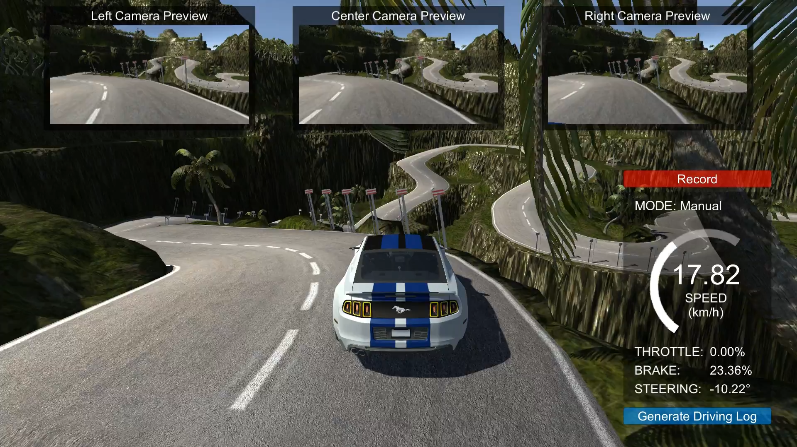

# Robust Behavioral Cloning for Autonomous Vehicles

In this work, we present a lightweight pipeline for robust behavioral cloning of a human driver using end-to-end imitation learning. The proposed pipeline was employed to train and deploy three distinct driving behavior models onto a simulated vehicle.

## Simulation System
The simulation system employed for validating the proposed pipeline was a rework of an [open source simulator](https://github.com/udacity/self-driving-car-sim) developed by Udacity. The source files of the `Behavioral Cloning Simulator` can be found [here](https://github.com/Tinker-Twins/Behavioral-Cloning-Simulator).

The simulator currently supports two tracks, viz. `Lake Track` and `Mountain Track`, for training and testing three different driving behaviors.

| Lake Track | Mountain Track |
| :---------:| :------------: |
|  |  |

## Driving Scenarios

The `Lake Track` is used for training and testing simplistic driving and collision avoidance behaviors, while the `Mountain Track` is used for training and testing rigorous driving behavior.

| Simplistic Driving Scenario | Rigorous Driving Scenario | Collision Avoidance Scenario |
| :-------------------------: | :-----------------------: | :--------------------------: |
|  |  |  |

## Robustness Testing Experiments

### Lake Track

| Experiment | Parameter | Original Value | Variation |
| :--------: | :-------: | :-------: | :-------: |
| No variation | None | NA | NA |
| Scene obstacle variation | Obstacles | 0 | {0, 10, 20} |
| Scene light intensity variation | Light intensity | 1.6 cd | ±0.1 cd |
| Scene light direction variation | Light direction (X-axis) | 42.218 deg | ±1 deg |
| Vehicle position variation | Vehicle pose | Pos: 179.81, 1.8, 89.86 m<br>Rot: 0, 7.103, 0 deg| Pos: -40.62, 1.8, 108.73 m<br>Rot: 0, 236.078, 0 deg |
| Vehicle orientation variation | Vehicle orientation (Y-axis) | 7.103 deg | ±5 deg |
| Vehicle heading inversion | Vehicle pose | Pos: 179.81, 1.8, 89.86 m<br>Rot: 0, 7.103, 0 deg | Pos: 179.81, 1.8, 89.86 m<br>Rot: 0, 187.103, 0 deg |
| Vehicle speed limit variation | Speed limit | Python script: 25 km/h<br>Unity editor: 30 km/h | +5 km/h (same in Python <br>script and Unity editor) |

### Mountain Track

| Experiment | Parameter | Original Value | Variation |
| :--------: | :-------: | :-------: | :-------: |
| No variation | None | NA | NA |
| Scene obstacle variation | Obstacles | NA | NA |
| Scene light intensity variation | Light intensity | 1.0 cd | ±0.1 cd |
| Scene light direction variation | Light direction (X-axis) | 50 deg | ±1 deg |
| Vehicle position variation | Vehicle pose | Pos: 170.62, -79.6, -46.36 m<br>Rot: 0, 90, 0 deg| Pos: 170.62, -79.6, -56.36 m<br>Rot: 0, 90, 0 deg |
| Vehicle orientation variation | Vehicle orientation (Y-axis) | 90 deg | ±5 deg |
| Vehicle heading inversion | Vehicle pose | Pos: 170.62, -79.6, -46.36 m<br>Rot: 0, 90, 0 deg | Pos: 170.62, -79.6, -41.86 m<br>Rot: 0, 270, 0 deg |
| Vehicle speed limit variation | Speed limit | Python script: 25 km/h<br>Unity editor: 30 km/h | +5 km/h (same in Python <br>script and Unity editor) |

## Implementation

### Data Collection

Pre-recorded datasets are available within this repository. They can be accessed within each of the four directories:

- [Simplistic Driving Behavior](https://github.com/Tinker-Twins/Robust_Behavioral_Cloning/tree/main/1.%20Simplistic%20Driving%20Behaviour/Dataset)
- [Rigorous Driving Behaviour](https://github.com/Tinker-Twins/Robust_Behavioral_Cloning/tree/main/2.%20Rigorous%20Driving%20Behaviour/Dataset)
- [Collision Avoidance Behaviour](https://github.com/Tinker-Twins/Robust_Behavioral_Cloning/tree/main/3.%20Collision%20Avoidance%20Behaviour/Dataset)
- [NVIDIA's Approach vs Our Approach](https://github.com/Tinker-Twins/Robust_Behavioral_Cloning/tree/main/4.%20NVIDIA's%20Approach%20vs%20Our%20Approach/Dataset)

To record your own dataset, follow the following steps:

- Launch the `Behavioral Cloning Simulator` (available [here](https://github.com/Tinker-Twins/Behavioral-Cloning-Simulator)).
- Select the track (`Lake Track` or `Mountain Track`).
- Select `Training Mode`.
- Click the `Record` button first time to select the directory to store the recorded dataset.
- Click the `Record` button second time to start recording the dataset.
- Drive the vehicle manually (click `Controls` button in `Main Menu` to get acquainted with the manual controls).
- Click the `Recording` button to stop recording the dataset. The button will show recording progress.

### Training Pipeline

The training pipeline is scripted in `Python3` and is implemented in the form of an `IPYNB`. It comprises of data balancing, augmentation, preprocessing, training a neural network and saving the trained model.

`Training.ipynb` file in each of the four directories implements the respective training pipeline and the trained models are also available in the respective directories as `H5` files.

### Activation Visualization & Prediction Analysis

This analysis pipeline is scripted in `Python3` and is implemented in the form of an `IPYNB`. It comprises of loading data for ~1 lap, loading trained model and using it to visualize the convolution filters, activation maps and steering angle predictions.

`Prediction.ipynb` file in each of the four directories implements the respective analysis pipeline and the results are stored in the `Results` direcotry within respective directories.

### Deployment

### Data Logging & Simulated Field Results

## Demo
Implementation demonstrations pertaining to this research on robust behavioral cloning for autonomous vehicles are available on [YouTube](https://youtube.com/playlist?list=PLY45pkzWzH9-M6_ZBjynKyPlq5YsCzMCe).

## Citation
Please cite the [following paper](https://arxiv.org/abs/2010.04767) when using any part of this work for your research:

```bibtex
@article{RBCAV2021,
      title={Robust Behavioral Cloning for Autonomous Vehicles using End-to-End Imitation Learning}, 
      author={Tanmay Vilas Samak and Chinmay Vilas Samak and Sivanathan Kandhasamy},
      year={2021},
      eprint={2010.04767},
      archivePrefix={arXiv},
      primaryClass={cs.RO}
}
```
